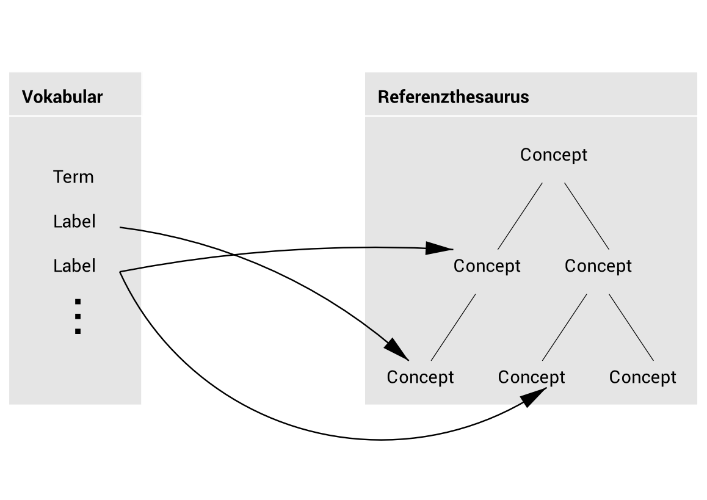
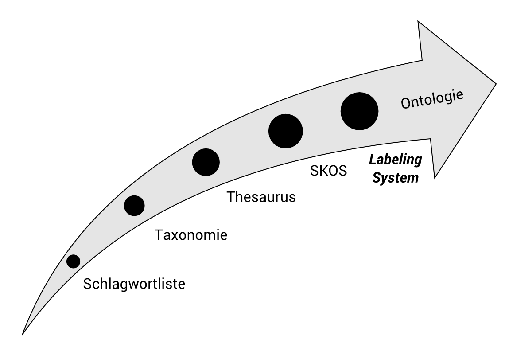
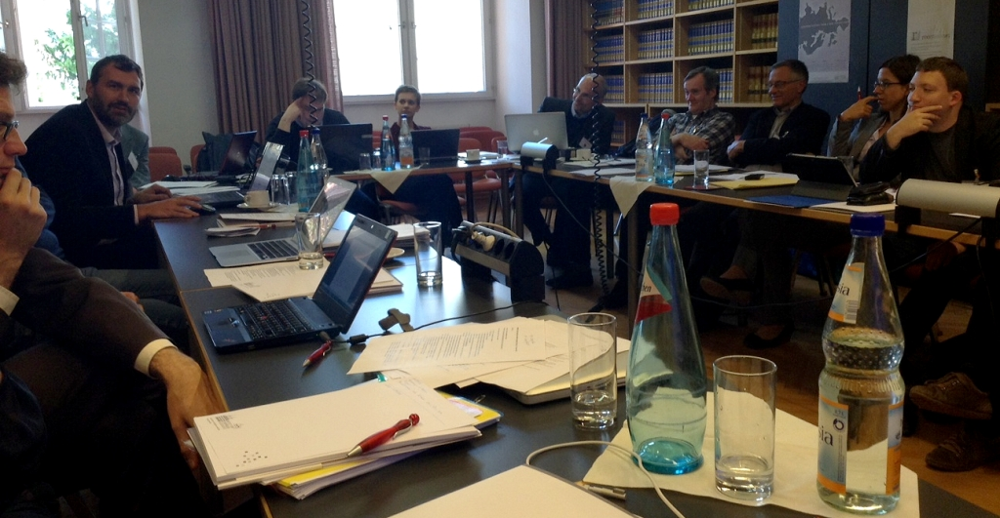
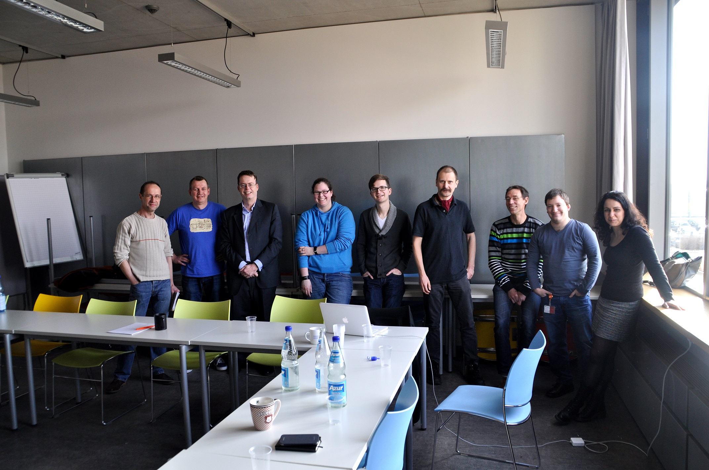
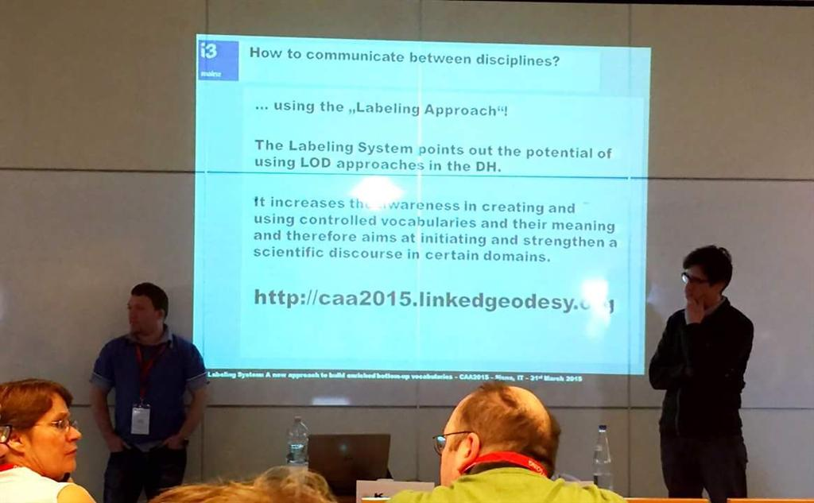
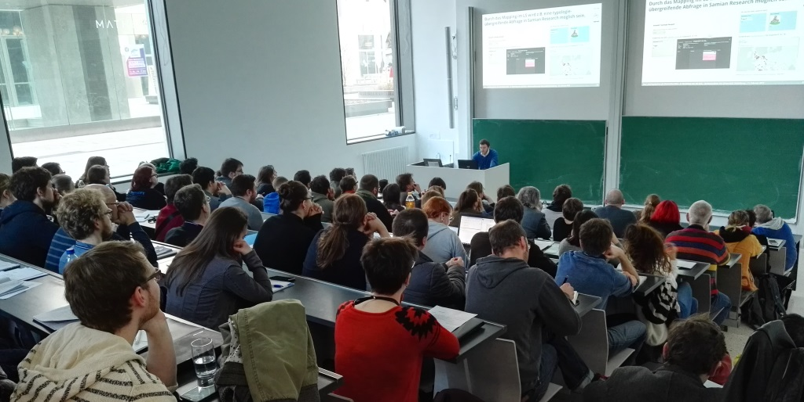

# Das Labeling Prinzip

## Der "Labeling Approach"

**The "Labeling Approch" approach is based on the idea that the terms of a vocabulary (constructed for a specific application) are defined by linking them to one or more concepts in an online reference thesaurus. Vocabulary terms can thus be understood as “labels” for particular sets of concepts.**

[]( _images/labeling.png)

```
A vocabulary consists of a set of TERMS
A term linked to a reference thesaurus or web resource becomes a LABEL
```

## Konzeptionaller Ansatz

### Ansatz nach Piotrowski et al.

Der konzeptionelle Ansatz wurde in *The Labeling System: A New Approach to Overcome the Vocabulary Bottleneck* von Michael Piotrowski, Giovanni Colavizza, Florian Thiery und Kai-Christian Bruhn in Kapitel 3 wie folgt beschrieben [Quelle: DOI:10.1145/2657480.2657482](https://doi.org/10.1145/2657480.2657482):

*As outlined above, our approach is based on the idea that the terms of a vocabulary (constructed for a specific application) are defined by linking them to one or more concepts in an online reference thesaurus. Vocabulary terms can thus be understood as “labels” for particular sets of concepts. This approach is motivated by the observation that vocabulary construction is generally hard for domain experts who do not happen to be also experts in knowledge representation, and that it is even harder in a research context, where the vocabulary is part of the research process, not merely a reflection of established facts. Our goal is to “keep things simple” and offer users an easy-to-follow way to vocabulary construction. We therefore make two simplifying assumptions, which are, however, not inherent restrictions of our approach.*

*The first assumption is that project vocabularies will typically have a flat structure, whereas reference thesauri may have more complex, hierarchical structures, as shown in figure 1. The second assumption is that for linking vocabulary terms to reference thesaurus concepts, we mostly use the skos:related relation; the current implementation in the Labeling System (see section 4) also offers users the skos:narrower and skos:broader relations, and further relations could be added.*

*Although our approach is general and can be applied to any domain, we exemplify it with the use case of historical place types. As many things in historical studies, place types are difficult to establish. Not only do historians look at historical places from different perspectives and in the context of varying research questions, but the object itself defies simplification. Another aspect historians must consider is that of sources. For example, in republican Venice the term palazzo ‘palace’ by convention referred to the doge’s palace as the seat of power, and never to other noble residences. A controlled vocabulary that forces historians interested in noble housing in Venice to only use the term palace would be limiting. On the other hand, a highly specialized vocabulary that makes a distinction on the label level between the doge’s palace and all other palaces would prevent portability and data integration with other, less specific datasets.*

*The method we suggest aims to avoid such pitfalls. Vocabulary integration can happen on the level of labels and/or or the level of concepts. In the example of the doge’s palace, the historian could opt for different terms linked to partially overlapping sets of concepts, or for two instances of the same label—two vocabulary terms with the same label—again linked to partly different sets of concepts. The distinction between two identical labels with different definitions can be made via namespaces—among different projects—or naming rules—within the same project. It is also possible to link different labels to identical sets of concepts; these labels can then be used interchangeably, for example to reflect conventional designations. It is therefore an approach that maximizes flexibility and vocabulary interoperability at the same time.*

*The role of concepts is particularly important. In the Labeling System (see section 4), concepts are specified within the SKOS framework, but nothing prevents the use of a more structured and fine-grained ontology or a more lightweight thesaurus. This flexibility permits users to structure concepts relationally, for example in a hierarchy by detail, from general to specific. In this way, specific concepts can inherit the broader concepts they are related to. Interoperability and comparative potential among controlled vocabularies is ensured at the concept level, where the creation of new entities should therefore be limited to domain experts.*

*A conceptual domain of interest for historical place types is that of functions. The historical functions of a place are typically among the key elements historians focus on, since functionality informed and informs the human definition of a place. To come back to the example of monasteries, the wider vocabulary term could be religious place. A religious place is usually identified by a set of functions such as worship or ritual. But it would be possible to use a concept like Cluny ritual, which is more narrow and inherits from more general ones such as ritual or Catholic ritual. At the monastery level, several possible perspectives can inform the choice of related concepts. A historian studying the administrative structure of the Catholic Church might be interested in distinguishing between monasteries that were heads of parishes and those that were not. If the focus is on economic history, then the administration of estates or storage and production facilities might be the functions distinguishing several typologies of monasteries. Examples of this sort are countless. Note that the concepts assigned to a term need not be exhaustive, i.e., it is not necessary to describe all functions a monastery could possibly have. The idea is rather to assign those concepts that a term shares with other terms in the vocabulary and those concepts that differentiate a term from other terms in the vocabulary.*

*Our proposed method is designed as a general approach to address a set of requirements at once. First of all, the need for flexibility in the choice of the labels for a controlled vocabulary needs to be balanced with the inherent strictness required by any attempt at interoperability.Secondly, the stakeholders for controlled vocabularies belong to many different fields and possess varying skill sets for knowledge engineering. By separating the definition of vocabulary labels and the definition of concepts into distinct levels, we believe that these aims can be achieved.*

### Ansatz nach Thiery &. Engel

In *The Labeling System: A bottom-up approach for enriched vocabularies in the humanities* von Florian Thiery und Thomas Engel, Kapitel 2, wird der "Labeling Approch" erweitert [Quelle: IBAN:9781784913380](http://www.archaeopress.com/Public/displayProductDetail.asp?id=%7B27710CAF-069B-43D3-A53B-4BB1A293F456%7D):

*Labels created through the ‘Labeling Approach’ are specified as concepts within the SKOS ontology, providing the flexibility to structure concepts relationally and multilingual. It provides a set of methods and ideas for designing a controlled vocabulary, helping researchers to communicate internally, as well as between disciplines using LOD (Section 4). The ‘Labeling Approach’ contains the following steps:*

*(1) Creation of detailed concepts for individual research questions: Each specific research topic has its own list of concepts with an individual meaning. Concepts in authoritative reference thesauri are often broad and generic. However, individual concepts are assigned according to their position within the reference thesauri hierarchy. Defining a relation to an existing concept permits integration of personal labels within the Semantic Web (Section 4.1).*

*(2) Enrichment of concepts by linking into a hierarchy of a domain expert's reference thesaurus: Adopt expert’s knowledge and hierarchical structures and relations for a label (Section 4.2 and Figure 2).*

*(3) Defining a label to add specifications of different domains: The process of interlinking vocabulary terms to different concepts helps the user to clarify the reasoning and the layer of knowledge the label is representing (Section 4.3).*

*(4) Linking generic tags to specific contexts: One term can have different meanings. They are specified using diverse reference concepts (Section 4.3).*

## Ist ein Vokabular ein kontrolliertes Vokabular?

Die Entwicklung kontrollierter Vokabulare kann in drei Schritte unterteilt werden:

1. Analyse
2. Erstellung
3. Wartung und Pflege

Bei der Erstellung von Begriffen und deren Relationen zu anderen Concepts startet ein evolutionärer Prozess:

**Ausgehend von einem "naiven Begriff" als Schlüsselwort, der sich zu einem sinnvollen "intelligenten Begriff" aus Beschreibungen über Text und Links in der Linked Data Cloud entwickelt.**

[]( _images/situated.png)

Ein Vokabular im Labeling System und dessen Begriffe kann als "angereicherter Thesaurus" (enriched thesuarus) bezeichnet werden, der Begriffe mit kontextgebundener Gültigkeit enthält. Somit ist es nicht nur möglich ein "klassisches" kontrolliertes Vokabular mit eindeutigen Schlüsselwörtern zu erstellen.

Das Labeling System kann verwendet werden um einfache Keyword-Listen aufzubauen. Die Funktionalität geht jedoch über die Definition von Taxonomien (Bildung von Klassen und Kategorien) hinaus. Das Labeling System erlaubt die Erstellung von Thesauri im Sinne der detaillierten Beschreibung und Darstellung des Begriffs im Kontext eines Fachgebietes (kontextgebundene Gültigkeit). Thesauri basieren im Allgemeinen auf einem kontextgebundenen Thema (=Vokabular) und stellen eine Sammlung von systematisch organisierten Begriffen dar, die in thematischer Beziehung zueinander stehen (=Begriff). Diese Begriffe können durch Übersetzungen beschrieben und hierarchisch organisiert werden. Die Web-App ermöglicht es kontextbezogene, standardisierte, mehrsprachige Begriffe zu erstellen, die auf bereits vorhandenen oder neu zusammengesetzten Referenzthesauri basieren.

## Vierkomponentenmodell

Digitale Informationssysteme können nach vier Komponenten (`HSDA`) bzw. Funktionen (`EVAP-Prinzip`) geordnet werden (nach ["Geoinformatik in Theorie und Praxis, Norbert de Lange, Springer-Verlag Berlin Heidelberg, 2013, DOI:10.1007/978-3-642-34807-5"](http://www.springer.com/de/book/9783642348068)):

### HSDA

* **Hardware**: Computersystem einschließlich Prozessor, Speichermedien, Peripheriegeträte und Vernetzung
* **Software**: Programmsysteme einschließlich Softwarewerkzeuge zur Erfassung, Verwaltung, Analyse und Präsentation der Informationen
* **Daten**: quantitative und qualitative Informationen, die zusammen einen (fachbezogenen) Ausschnitt der realen Welt darstellen
* **Anwender**: Benutzer mit ihren Anforderungen und Fragestellungen bzw. Anwendungen und Einsatzmöglichkeiten

### EVAP-Prinzip

* **Erfassung**: Daten- oder Informationserfassung und -speicherung (d.h. Input)
* **Verwaltung**: Datenverwaltung (d.h. Management)
* **Analyse**: Datenauswertung und Analyse (d.h. Analysis)
* **Präsentation**: Wiedergabe der Information (d.h. Output bzw. Presentation)

### Vierkomponentenmodell in GIS

In `Geoinformationssystemen (GIS)` kann `HSDA` wie folgt dargestellt werden:

* **Hardware**: leistungsfähige Arbeitsplatzrechner
* **Software**: Modellierung von geoobjekten der realen Welt und Abbildung in einem digitalen Informationssystem
* **Daten**: digital erfasste und zu pflgende Daten (Geometrie-, Topologie- und Sachdaten), Datenaustausch, Mehrfachnutzung, einheitliche Datenstandards
* **Anwender**: Software und Daten werden erst durch Anwender zur Lösung konkreter Fragestellungen in Wert gesetzt. Anwender und Anwendungen sind untrennbar verknüpft.

Das Labeling System sieht sich als `Begriffs-Informationssystem (BIS)` oder `Begriffs-Gazetteer` das sowohl `HSDA` als auch das `EVAP-Prinzip` unterstützt:

### HSDA im Labeling System

* **Hardware**: benötigt wird ein internetfähiger PC und ein Server
* **Software**: Webapp mit EVAP-Funktionen
* **Daten**: Begriffe mit kontextgebundener Gültigkeit
* **Anwender**: Fachwissenschaftler der Geisteswissenschaften mit spezifischen Fragestellungen

### EVAP-Prinzip im Labeling System

* **Erfassung**: Erfassung und Speicherung von Vokabularen und Begriffen
* **Verwaltung**: Daten-Management und Speicherung der Daten-Historie
* **Analyse**: Analysemöglichkeiten durch SPARQL und standartisiertes SKOS-Modell
* **Präsentation**: nutzerfreundliche HTML-Ansicht der Vokabulare und Begriffe

## Geschichte

Erste konzeptionelle Ideen stellte Giovanni Colavizza (IEG) in einem DARIAH-DE Experten-Workshop »Controlled Vocabularies for Historical Place Types« internationalen Experten verschiedener Disziplinen vor. Aus intensiven Diskussionen entstand eine Kooperation zwischen i3mainz und IEG zur Implementierung des Labeling System.

[zum Bericht](http://dhd-blog.org/?p=2589)

[]( _images/dariahworkshop.jpg)
*(c) by Michael Piotrowski, DHdBlog*

Das Labeling System wurde zudem auf diversen Konferenzen vorgestellt (siehe auch [Publikationen](pub.html)), hier einige Impressionen:

**Linked Open Data and digital ecosystems, 2015**

[zum Bericht](https://i3mainz.hs-mainz.de/de/pressemitteilungen/dr.-gabriel-bodard-am-i3mainz)

[]( _images/2015-Gabriel-Bodard.jpg)
*(c) i3mainz*

**CAA Siena, 2015**

[zum Bericht](https://i3mainz.hs-mainz.de/de/pressemitteilungen/caa-2015-in-siena)

[]( _images/IMG_20150417_102201_Annabel_Lee_Enriquez.jpg)
*(c) Annabel Lee Enriquez, Getty Conservation Institute*

**AG CAA Heidelberg, 2017**

[zum Bericht](https://i3mainz.hs-mainz.de/de/pressemitteilungen/ag-caa-heidelberg)

[]( _images/201702-agcaa_florianthiery.jpg)
*CC BY 2.0, Hubert Mara, IWR Heidelberg*
