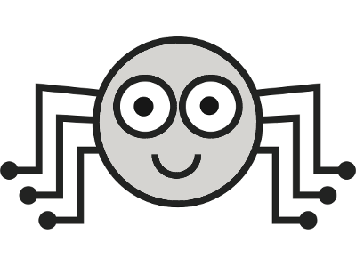
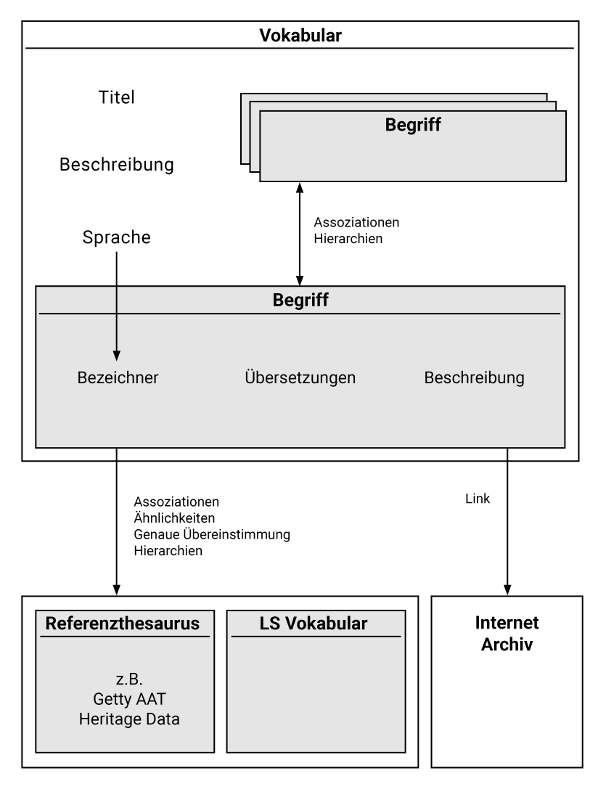

# Erste Schritte

**Das Labeling System ist eine Web-App zur Erstellung und Veröffentlichung von Begriffen mit kontextgebundener Gültigkeit als Linked Open Data.**

## Was ist das Labeling System?

Das Labeling System (LS) bietet Fachwissenschaftler*innen die Möglichkeit, Begriffe mit kontextgebundener Gültigkeit zu erzeugen, zu konkretisieren, in Containern zu gruppieren (Vokabulare) und mit der Forschungscommunity zu teilen.

Das Labeling System stellt nutzerfreundliche Werkzeuge bereit, die es ermöglichen, Begriffe mit der Linked Open Data Cloud semantisch zu verknüpfen.

Nachdem Vokabulare veröffentlicht wurden, dient das Labeling System als dezentrales Begriffs-Repositorium, das zitierfähige Adressen im Web bereitstellt.

Jeder erzeugte Begriff wird seinem Ersteller eindeutig zugeordnet. Durch diese gesicherte Autorenschaft ergibt sich eine eindeutige Verantwortlichkeit der Datenpflege.

## Das Datenmodell

## Komponenten des Systems

* Viewer zur öffentlichen Ansicht der Begriffe
* Editor zum Entwickeln von kontextgebundenen Vokabularen
* Dokumentierte Schnittstellen / API

## Editor Funktionen

* Erstellen von Begriffen
* Modellierung von Begriffen als LOD durch ein vereinfachtes SKOS-Modell, das auf geisteswissenschaftliche Fragestellungen spezialisiert ist:
  * Deskriptive Beschreibung eines Begriffs (Concept) durch einen Bezeichner (Label), Übersetzungen und eine Kurzbeschreibung
  * Konkretisierung des Begriffs durch Links:
    * Hierarchische Verknüpfungen (broader, narrower)
    * Assoziative Verknüpfung (related)
    * Mapping (close match, exact match)
  * Einfaches Verknüpfen von Begriffen mit Referenz-Thesauri (z.B. Getty, Heritage Data, …) durch Stichwortsuche
  * Verknüpfungen zu Web Ressourcen des Internet Archive
  * Gruppierung von Begriffen → kontextgebundenes Vokabular
  * Veröffentlichen / Teilen von Vokabularen und dessen Begriffen durch HTTP adressierbare URIs
* Prototypisches Arbeiten im „Entwurfsmodus“ ohne Veröffentlichung

## Viewer

* Dezentrales Begriffs-Repositorium (“Begriffs-Gazetteer”) → Projektübergreifende Nutzbarkeit
* Nutzerfreundliche, lesbare HTML-Ansicht

## Technologie / System

**Frontend**
* AngularJS 1.x
* CSS3
* HTML5

**Backend**
* JAVA + Maven
* RDF4J Triplestore
* SQlite

**Ontologie**
* SKOS
* Dublin Core
* Friend of a Friend
* W3C Provenance
* LS Vokabular

**Schnittstellen**
* dokumentierte API
* cool URIs
* RESTful interface
* SPARQL endpoint

## Institute und Personen

Gemeinschaftsprojekt des mainzed mit den Partnern RGZM, i3mainz, IEG

**Backend Architektur und API Entwicklung**
* Florian Thiery (i3mainz, RGZM)

**User Interface Design / CSS**
* Matthias Dufner (i3mainz)

**AngularJS Entwicklung**
* Axel Kunz (i3mainz)

**Ursprüngliche Projektidee**
* Michael Piotrowski (IEG)
* Giovanni Colavizza (IEG)

*Ursprünglich hervorgegangen aus einem DARIAH-DE-Expertenworkshop »Controlled Vocabularies for Historical Place Types«. Das Ziel des Workshops war es, Experten aus verschiedenen Disziplinen an einen Tisch zu holen und Prinzipien für die Entwicklung eines kontrollierten Vokabulars für historische Ortstypen und eine ersten Version eines Grundvokabulars zu entwickeln.*

## Exemplarische Anwendungsszenarien

Es haben sich bislang zwei konkrete Anwendungsfälle ergeben:

**1. Lösung von Mehrdeutigkeiten**

Bei Homonymen oder Begriffsstreitigkeiten genügen natürlichsprachliche Bezeichner nicht zur eindeutigen Definition. Das Labeling System bietet die Möglichkeit, über ein Set von Assoziationen Aussagen zu schärfen und somit kontextgebundene Aussagen zu treffen.

Im Falle eines Begriffs mit dem Label „Gold“ sorgt die Verknüpfung mit dem broad Match “non-ferrous metal” aus dem FISH Archaeological Sciences Thesaurus für Klarheit – mit „Gold“ ist in diesem Fall das chemische Element und nicht z.B. die Wertanlage gemeint.

Wichtig für das Verständnis ist hier, dass es eine Vielzahl von Begriffen geben kann, die alle den gleichen Namen “Gold” tragen.

Dieses Vorgehen ist beispielsweise für Textannotation interessant, da mit kontextgebundenen Schlagworten gearbeitet werden kann. Diese Schlagworte sind gleichzeitig intelligenter als reine Zeichenfolgen, weil sie direkt mit anderen Wissensdomänen verknüpft sind. Durch die Verknüpfungen ist es möglich, Verwandtschaften zwischen Begriffen aufzudecken.

**2. Verknüpfung von (Fach-)Datenbanken über dezentrale Repositorien**

Wenn Datensätze aus unterschiedlichen Fachdatenbanken inhaltlich miteinander verknüpft werden sollen, kann ein Begriff als gemeinsamer dezentraler Knotenpunkt verwendet werden. Dieser Ansatz wurde bereits mit Orts- und Zeit-Gazetteers implementiert (z.B. Geonames, Chronontology).

Der Unique Resource Identifier (URI) kann hier als Fremdschlüssel in die Cloud verwendet werden. Diese Methode erlaubt später Abfragen, die Zusammenhänge zwischen verteilten Datenbanken und deren Objekten anzeigen.

Darüber hinaus können die in den Datenbanken enthaltenen kontextgebundenen Fachvokabulare dezentral veröffentlicht und der Forschungscommunity als zitierfähige URI als Teil des Semantic Webs zur Verfügung gestellt werden.

Konkret wird dies an den Fachdatenbanken des RGZM wie NAVIS, Tomba, Samian Research und der zentralen Objektdatenbank easyDB Schritt für Schritt realisiert.
