# Handbuch Editor

*Stand: 19.05.2017*

## Registrierung und Login

### Nutzer-Registrierung

Die Nutzerregistrierung erfolgt zur Zeit manuell über den Admin, siehe [Kontakt](contact.html).

Jeder Nutzer ist eindeutig identifizierbar. Hierzu sind der vollständige Name inkl. Titel, eine [ORCID](https://orcid.org/) und die Affiliation mit Referenz zum GND (z.B. [HS Mainz](http://d-nb.info/gnd/1063654211)) nötig.

WICHTIG: Zur Zeit sind noch keine Gruppen von Nutzern möglich, so dass zusammen an einem Vokabular gearbeitet werden kann.

### Login

Der Editor ist über einen Login erreichbar. Dieser kann über `[host]/#/editor` addressiert werden.

Für den Development Server gilt: [http://ls-dev.i3mainz.hs-mainz.de/#/editor/login](http://ls-dev.i3mainz.hs-mainz.de/#/editor/login) .

Für labeling.link gilt: [http://labeling.link/#/editor/login](http://labeling.link/#/editor/login)

## Vokabular

### Vokabularübersicht

Beim ersten Login ist die Vokabularübersicht leer:

Nach Erstellen von Vokabularen werden diese als Kacheln angezeigt:

Publizierte Vokabulare sind grau, Entwürfe werden gelb angezeigt.

Das Vokabular wird durch Titel, Beschreibung, Sprache, Anzahl der beinhaltenden Konzepte und Anzahl der Verlinkungen (intern) und extern angezeigt.

Über den Filter kann eine Reduktion der Ergebnisse anhand des Titels erfolgen.

Über die drei Punkte kann ein Vokabular bearbeitet werden, siehe [Vokabulareigenschaften](#vokabulareigenschaften).

### Neues Vokabular erstellen

Über den Plus-Button kann ein neues Vokabular erstellt werden.

Danach öffnet sich ein Dialog in dem zwingend ein Titel, eine Beschreibung, eine Sprache und eine Lizenz angegeben werden muss. Durch "Create" wird das Vokabular erstellt. Jedes Vokabular erhält eine eigene eindeutige ID und URI.

Nach erfolgreicher Erstellung öffnet sich eine Übersicht der Konzepte des Vokabulars. Diese ist zur Zeit (noch) leer.

### Vokabulareigenschaften

Über die drei Punkte kann ein Vokabular über einen Dialog bearbeitet werden. Dies kann in der Vokabularübersicht, wie auch in der Konzeptübersicht erfolgen. Der Dialog kann über einen Klick auf X oder neben dem Dialog geschlossen werden. Die Änderungen werden gespeichert.

Solange das Vokabular im Editor-Modus ist, kann der Titel, die Beschreibung und die Lizenz geändert werden.

Ein Vokabular kann zudem im Editor-Modus gelöscht oder publiziert werden. Zudem ist hier ein Download als SKOS-RDF möglich. Durch veröffentlichen eines Vokabulars werden alle Konzepte öffentlich verfügbar. Konzepte dieses Vokabulars können nicht mehr gelöscht werden. Teile der Konzepte können noch verändert werden. Dies wird in einer Änderungshistorie gespeichert.

Zum löschen oder publizieren ist eine erneute Bestätigung nötig:

[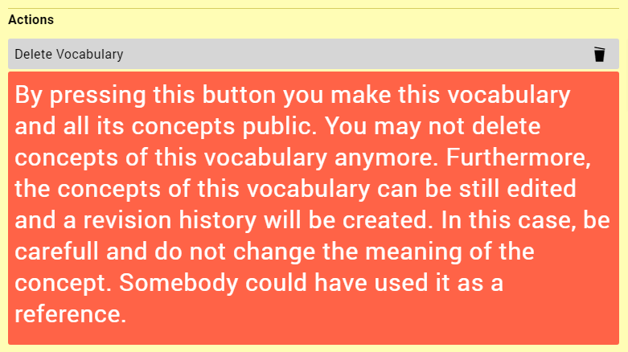](_images/ug_e_vocabularyedit4.PNG)

Für jedes Vokabular können mehrere eine Referenzthesauri eingestellt werden, die in der Suchabfrage im Konzept-Detail durchsucht werden sollen. Duch klick auf einen Referenzthesaurus wird dieser aktiviert bzw. deaktiviert.

[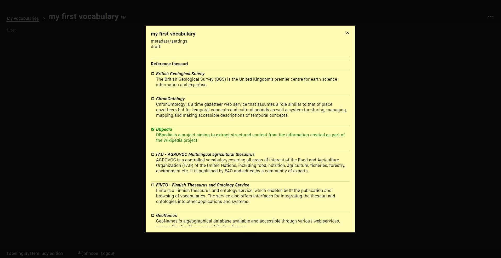](_images/ug_e_vocabularyedit5.PNG)

Zudem können Referenz Vokabulare eingestellt werden, welche ebenfalls zur Verknüpfung im Konzept-Detail dienen.

## Konzept

### Konzeptübersicht

Die Konzept-Übersicht ist bei einem neuen Vokabular leer.

Nach Erstellen von Vokabularen werden diese als Listen-Kacheln angezeigt:

Über den Filter kann eine Reduktion der Ergebnisse anhand des Titels erfolgen.

Zudem kann die Liste sortiert werden (Änderungsdatum, alphabetisch, Qualität). Konzepte und deren Bechreibungen können in einer Vorschau über den Breadcrumb oder extend all angeziegt werden. Eine visuelle Vorschau des Konzepts ist über die [Concept-Preview](#concept-preview) möglich.

Über die drei Punkte können Metadaten eines Konzepts bearbeitet werden, siehe [Konzepteigenschaften](#konzepteigenschaften).

Durch Klick auf ein Konzept kann zur [Konzept-Detail-Übersicht](#konzept-detail) gesprungen werden.

### Neues Konzept erstellen

Über den Plus-Button kann ein neues Konzept erstellt werden.

Danach öffnet sich ein Dialog in dem zwingend ein Label angegeben werden muss. Dieser Bezeichner muss zwingend in der Sprache des Vokabulars erfolgen. Eine Auswahl einer anderen Sprache ist nicht möglich. Durch "Create" wird das Konzept erstellt. Jedes Konzept erhält dabei eine eigene eindeutige ID und URI.

[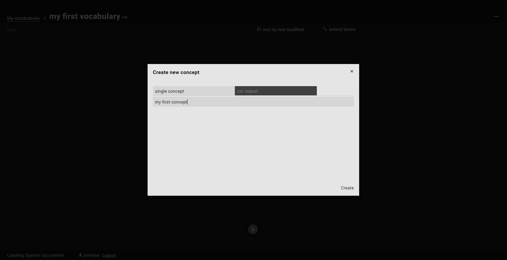](_images/ug_e_newconcept1.PNG)

Alternativ dazu kann eine Liste von Konzepten mit deren Übersetzungen und Beschreibungen als CSV hochgeladen werden. Siehe hierzu Sektion [CSV-Import](#csv-import).

Wurde ein Vokabular bereit veröffentlicht muss bei der Eingabe eines Labels dies zweimal erfolgen. Das Label kann danach nicht mehr geändert werden, so dass diese Funktion einen Typo verhindern soll.

Nach erfolgreicher Erstellung wird das Konzept der Konzeptübersicht hinzugefügt.

[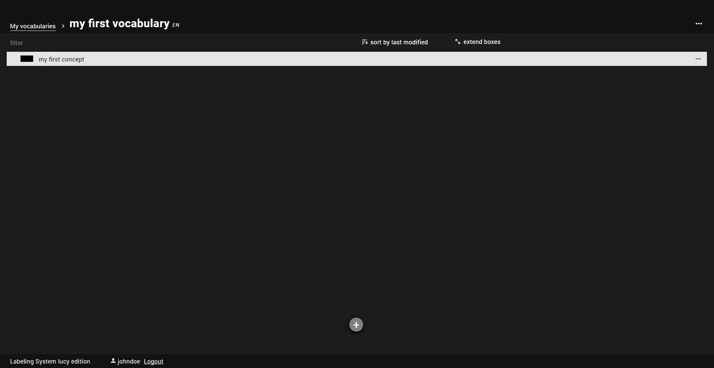](_images/ug_e_conceptsaftercreate.PNG)

Durch Klick auf das Konzept kann zur (noch) leeren [Konzept-Detail-Übersicht](#konzept-detail) gesprungen werden.

[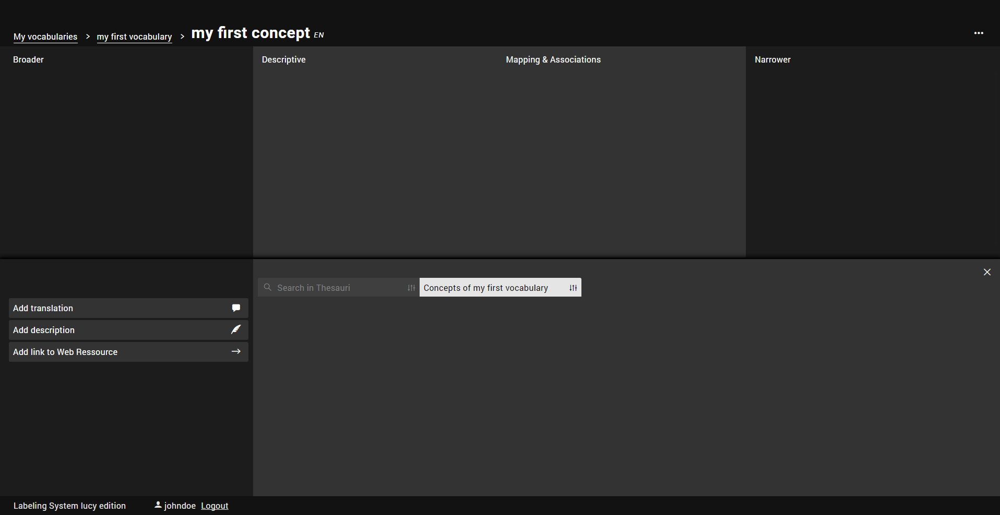](_images/ug_e_conceptdetailempty.PNG)

### Konzept-Detail

Die Konzept-Detail-Übersicht bietet mehrere Möglichkeiten zum anreichern von Detailinformationen.

Grundsätzlich ist die Übersicht in mehrere Sektionen aufgeteilt.

[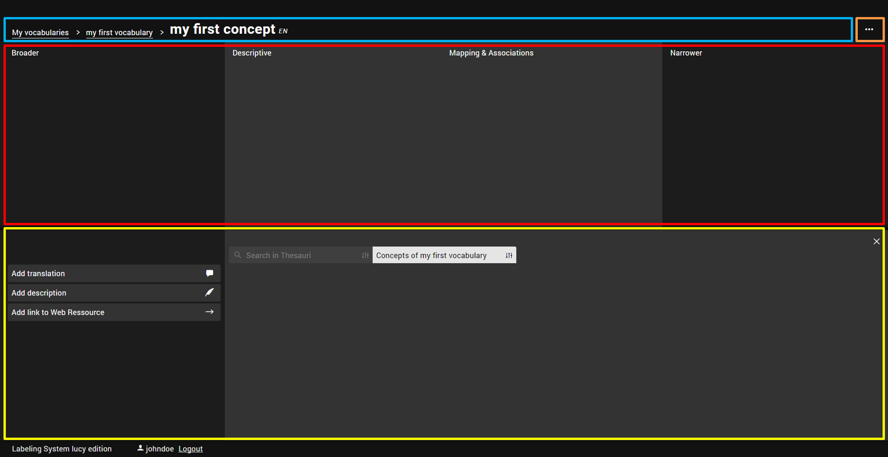](_images/ug_e_conceptdetailsections1.PNG)

* blau:
  * Breadcrumbs zur Übersicht in welchem Vokabular und Konzept man sich befindet
* orange:
  * generelle Konzepteigenschaften
* rot:
  * Beschreibungsbereich. Unter `Broader` und `Narrower` werden alle Konzepte / Ressourcen angezeigt, die in einer hierarchischen SKOS Struktur ein Konzept einen Level höher oder niedriger im Hierarchiebaum darstellen. `Descriptive` beinhaltet alle Übersetzungen und die Kurzbeschreibung. `Mapping & Associations` zeigt alle Referenzkonzepte und Ressourcen aus dem Internet Archive die im SKOS Sinne eine `related` bzw. `relatedMatch`, `closeMatch` oder `exactMatch` Beziehung aufweisen und somit eine Assoziation oder ein Mapping darstellen.
* gelb:
  * Der Enrichment-Browser stellt diverse Funktionen zur Verfügung, die ein Konzept anreichern können. Darunter, Übersetzungen, Beschreibungen, Links zum Internet Archive und Suchen in Referenzthesauri.

Zur Anreicherung sollte nun mit dem [Enrichment-Browser](#enrichment-browser) fortgefahren werden.

### Konzepteigenschaften

Über die drei Punkte kann ein Konzept über einen Dialog bearbeitet werden. Dies kann in der Konzeptübersicht, wie auch in der Konzept-Detail-Übersicht erfolgen. Der Dialog kann über einen Klick auf X oder neben dem Dialog geschlossen werden. Die Änderungen werden gespeichert.

Solange das Vokabular im Editor-Modus ist, kann der Bezeichner geändert werden. Zudem ist hier ein Download als RDF in diversen Formaten möglich. Ein Konzept kann gelöscht werden, solange es noch nicht veröffentlicht wurde. Hierzu ist eine Bestätigung nötig.

### Concept-Preview

Die Concept-Preview zeigt schemenhaft die Darstellung der Konzept-Detail Darstellung.

Die Concept-Preview existiert in zwei Varianten: small in der Konzeptübersicht und big in der Bearbeitungsübersicht.

### CSV-Import

Zu schnellen Anlegen von Konzepten kann auch eine CSV importiert werden.

Diese CSV Datei muss gewissen Vorgaben entsprechen, die im Folgenden erläutert werden.

Empfohlen wird diese Datei mit [Notepad++](https://notepad-plus-plus.org) oder [Libre Office](https://de.libreoffice.org) zu bearbeiten.

Wird die Datei mit Excel erstellt, wird empfohlen das Arbeitsblatt per `Copy&Paste` in Notepad++ zu überführen (hier werden automatisch tabs und `\r\n` als Spalten-/ Zeilentrennung gesetzt). Das Dokument muss nur noch in UTF-8 konvertiert werden.

`"` in thumbnail, translations und descriptions werden in `'` überführt.

* Die Datei ist als `UTF-8` zu kodieren
* Die Datei muss folgenden Header enthalten: `thumbnail\tdescription\ttranslations\tend\r\n`
* Spalten sind mit `Tabstop` (`\t`) zu trennen
* Zeilen sind mit `CR` `LF` (`\r\n`) zu trennen
* Übersetzungen sind mit `Semikolon` zu trennen in der Reihenfolge `translation1;languagecode;translation2;languagecode,...`
* Unterstützte languagecodes konnen dem [JSON](http://labeling.link/api/v1/languages) mit dem key `value` entnommen werden
* Die Konzepte sind zwingend der Header-Struktur anzupassen
* Jede Zeilen muss mit dem `END` tag und `\r\n` enden

**Beispiel**:

[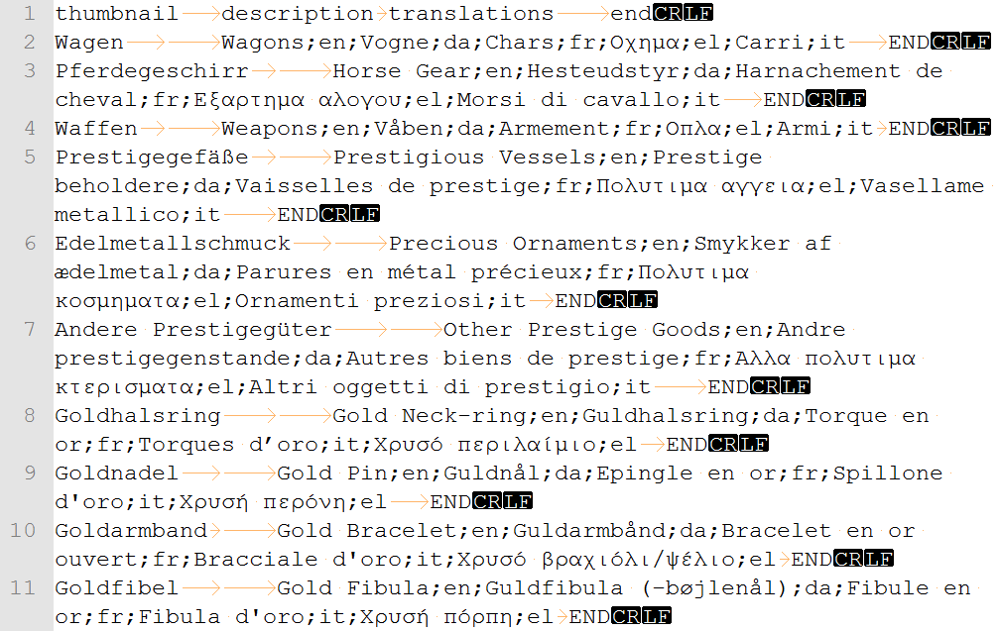](_images/ug_e_csvexample.png)

## Enrichment-Browser

Ein Konzept kann durch unterschiedliche Arten angereichert werden. Ist keine Anreicherung nötig, kann der Browser durch da X geschlossen werden.

### Beschreibung

Zunächt bietet sich an, das Konzept mit einer Beschreibung eindeutig zu definieren. Es ist nur eine Beschreibung in der Sprache des Vokabulars / Konzepts möglich.

Ein Klick auf `Add description` offnet einen Dialog, der zur Eingabe der Beschreibung auffordert. Apply speichert die Eingabe. Ein Klick auf X oder neben den Dialog schließt den Dialog ohne Aktion.

Nach erfolgreicher Speicherung wird die Beschreibung unter der Sektion `Descriptive` angezeigt.

[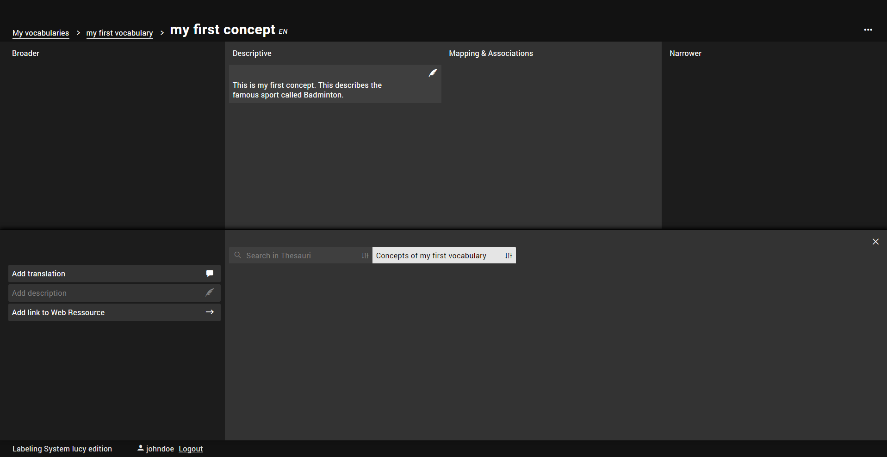](_images/ug_e_concept_eb_description2.PNG)

Durch Klick auf die Beschreibung kann das Element editiert oder gelöscht werden. Ein Klick auf das X oder neben den Dialog speichert die Änderungen. Bei einer Löschanfrage ist eine Bestätigung nötig.

[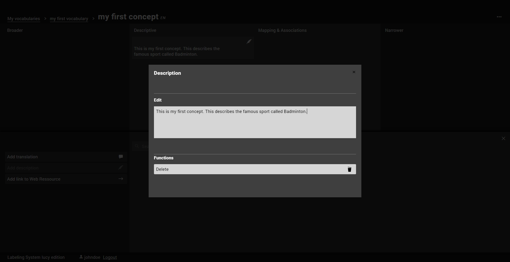](_images/ug_e_concept_eb_description3.PNG)

### Übersetzungen

Ein Konzept kann in mehreren Sprachen vorliegen. Die Primärsprache ist durch die Wahl der Vokabularsprache festgelegt. Übersetzungen können in einer Vielzahl von Sprachen angelegt werden. Es ist möglich mehr als eine Übersetzung anzulegen, jedoch nur eine Übersetzung je Sprache (nach SKOS prefLabel Prinzipien).

Ein Klick auf `Add translation` offnet einen Dialog, der zur Eingabe der Übersetzung und Sprache auffordert. Apply speichert die Eingabe. Ein Klick auf X oder neben den Dialog schließt den Dialog ohne Aktion.

[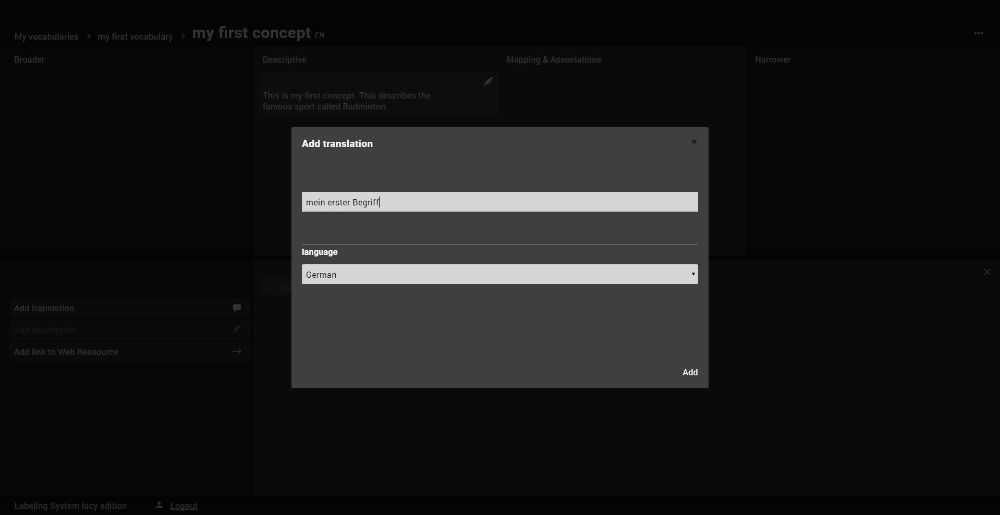](_images/ug_e_concept_eb_translation.PNG)

Nach erfolgreicher Speicherung wird die Übersetzung unter Angabe der Sprache unter der Sektion `Descriptive` angezeigt.

[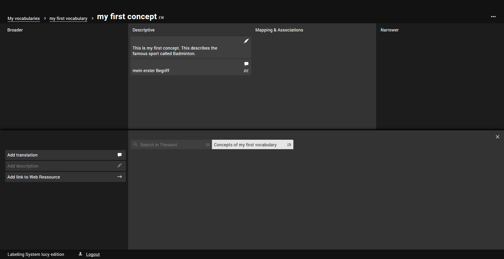](_images/ug_e_concept_eb_translation2.PNG)

Durch Klick auf die Übersetzung kann der Bezeichner der Übersetzung editiert werden oder die Übersetzung gelscht werden. Eine Änderung der Sprache ist nicht möglich. In diesem Fall muss die Übersetzung komplett gelöscht werden. Ein Klick auf das X oder neben den Dialog speichert die Änderungen. Bei einer Löschanfrage ist eine Bestätigung nötig.

[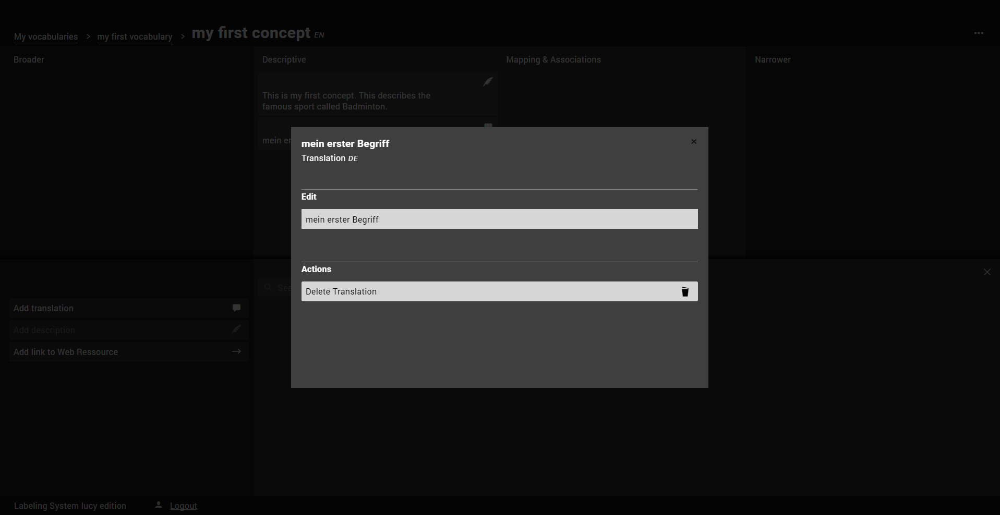](_images/ug_e_concept_eb_translation3.PNG)

### Link zum Internet Archive

Wird das Konzept bzw. Informationen zum Konzept in einer Web-Ressource beschrieben (z.B. Website), kann dies mit einem Link zum [Internet Archive](https://archive.org) erfolgen. Hier sind mehrfache Links möglich. Ist eine Website noch nicht vom Internet Archive erfasst, kann diese dort hinzugefügt werden. Das Internet Archive bietet persistente Adressen für Website an, welche auch langfristig zur Verfügung stehen.

Ein Klick auf `Add link to wayback Ressource` offnet einen Dialog, der zur Eingabe einer URL auffordert.

[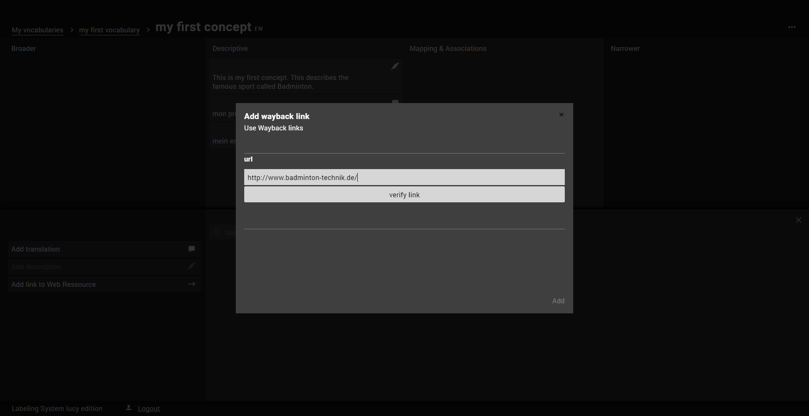](_images/ug_e_concept_eb_wayback.PNG)

Durch Klick auf `verify link` wird die URL daraufhin überprüft, ob sie im Internet Archive registriert ist und die persistente URI der Wayback Machine angezeigt. War die Verifizierung fehlerhaft erscheint wiederholt der Button `verify link`.

[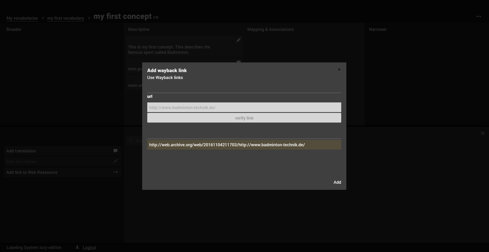](_images/ug_e_concept_eb_wayback2.PNG)

`Add` speichert die Eingabe. Ein Klick auf X oder neben den Dialog schließt den Dialog ohne Aktion.

Nach erfolgreicher Speicherung wird der Link unter der Sektion `Descriptive` angezeigt.

Durch Klick auf den Wayback-Link dieser in einem neuen Tab angesehen oder gelöscht werden. Bei einer Löschanfrage ist eine Bestätigung nötig.

### Suche

Es gibt zwei verschiedene Arten bestehende Konzepte von dem eigenen Konzept zu verbinden:

* Die Suche in Referenzthesauri
* Die Auswahl in einem Referenzvokabular

#### Suche in Referenzthesauri

Die Suche in Referenzthesauri wird durch Klick des linken Tab im Such-Modul aktiviert.

Durch Klick auf den `Config`-Button können die Referenzthesauri, die durchsucht werden sollen, ausgewählt werden. Standardmäßig sind bereits einige voreingestellt. Ein Klick auf den Thesaurus aktiviert / deaktiviert den Thesaurus. Ein Klick auf das X oder neben den Dialog speichert die Angaben.

[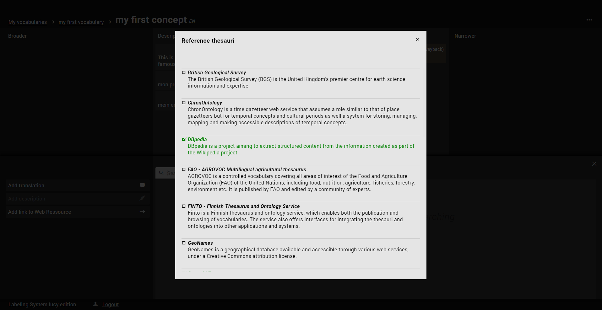](_images/ug_e_concept_eb_search2.PNG)

Nach Eingabe eines Wortes in den Suchschlitz und drücken der Enter-Taste werden die Referenzthesauri durchsucht und die Ergebnisse inkl. der Provinienz angezeigt. Mit Klick auf den Breadrumb kann eine detailliertere Beschreibung angezeigt werden.

Soll ein Suchergebnis in den Referenzthesauri direkt von einer verfügbaren URI aufgerufen werden ist der Prefix `uri:` voranzustellen, also zum Beispiel `uri:http://vocab.getty.edu/aat/300025414`.

[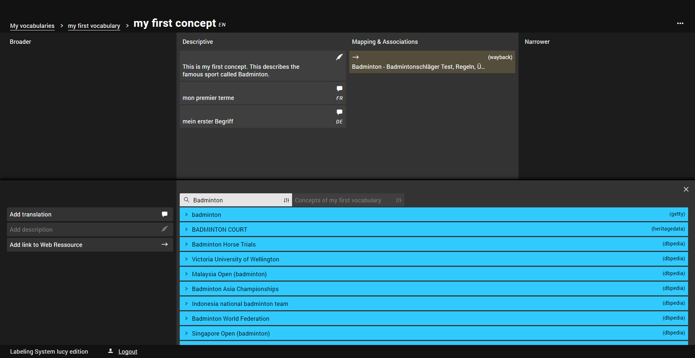](_images/ug_e_concept_eb_search3.PNG)

[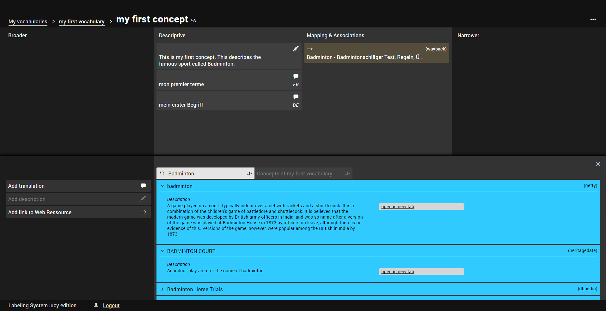](_images/ug_e_concept_eb_search4.PNG)

Mit Klick auf ein Suchergebnis wird ein Dialog geöffnet, der die Möglichkeiten zur Verknüpfung anzeigt. Mit Klick auf eine der Möglichkeiten wird dies gespeichert, bzw. mit Klick auf X oder neben den Dialog verworfen.

[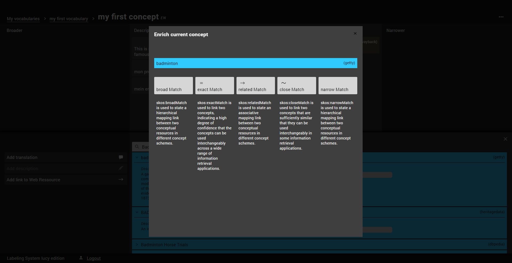](_images/ug_e_concept_eb_search5.PNG)

Nach erfolgreicher Speicherung wird der Link unter der gewählten Sektion angezeigt.

[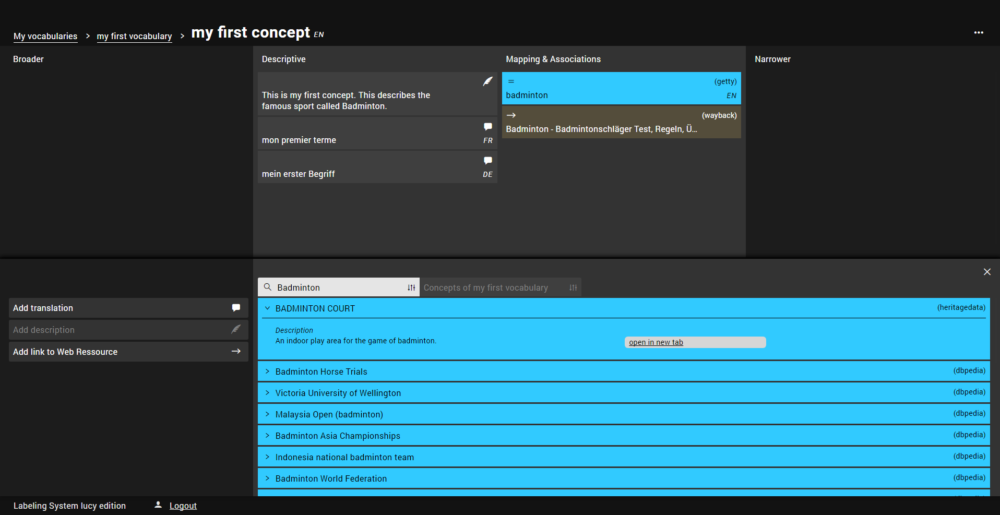](_images/ug_e_concept_eb_search6.PNG)

Durch Klick auf die Ressource kann die Art der semantsichen Verlinkung modifiziert werden, indem eine neue ausgewählt wird. Ein Klick auf das X oder neben den Dialog speichert die Änderungen. Bei einer Löschanfrage ist eine Bestätigung nötig.

[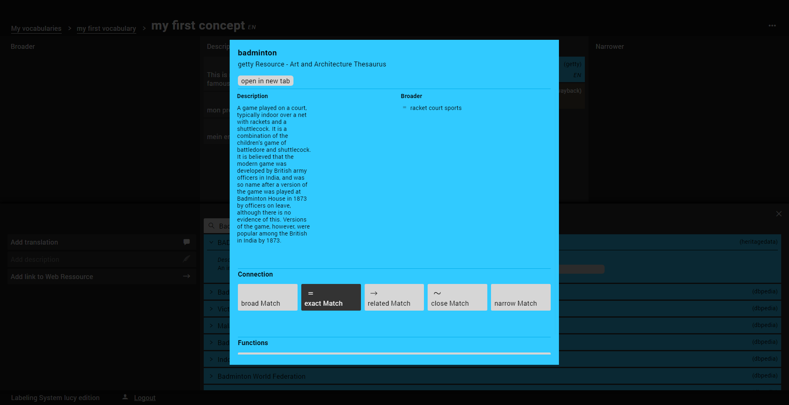](_images/ug_e_concept_eb_search7.PNG)

In der Anzeige der Suchergebnisse können Konzepte aus den verschiedenen Domänen erscheinen: externe Thesauri, andere Labeling System Vokabulare oder Konzepte aus dem eigenen Vokabular.

[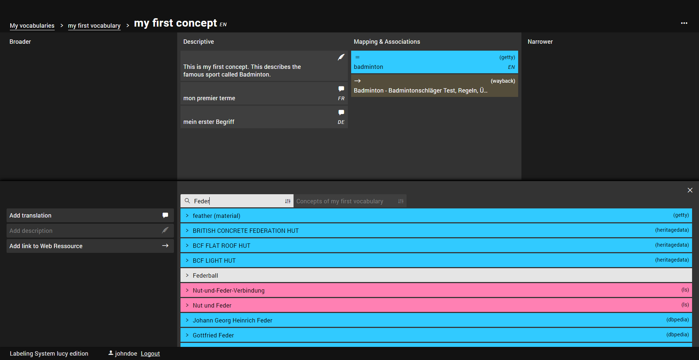](_images/ug_e_concept_eb_search8.PNG)

Links zu Konzepten im eigenen Vokabular haben andere Möglichkeiten zur semantsichen Verlinkung. Hier können hierarchische Beziehungen (hat ein breiteres Konzept wie... oder hat ein engeres Konzept wie...) oder Assiziationen angegeben werden. Hierbei ist darauf zu achten, dass hierarische Beziehungen nicht nach Zirkelschlüssen und Logik validiert werden. Dies liegt in der Eigenverantwortung des Bearbeiters.

[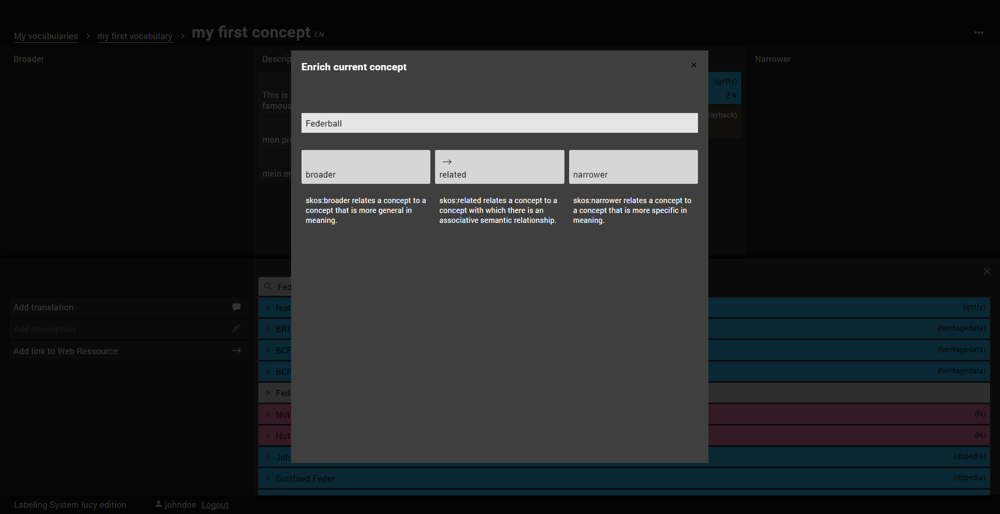](_images/ug_e_concept_eb_search9.PNG)

[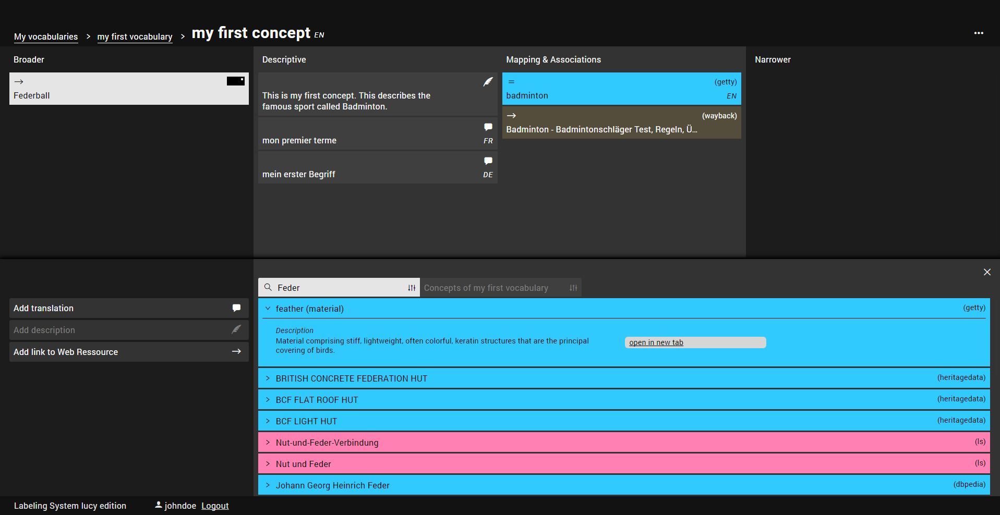](_images/ug_e_concept_eb_search10.PNG)

Wird ein Link zu einem Konzept des eigenen Vokabulars gesetzt wird dies mit einem kleinen Concept-Preview in der rechten oberen Ecke angezeigt. Wird eine broader, narrower oder related Verknüpfung gesetzt so wird diese bidirektional gesetzt.

Die Bearbeitungsansicht eines Konzepts des Labeling Systems gibt detailliertere Informationen wie label, Beschreibung, broader und narrower Konzepte und Concept-Preview aus. Es ist auch durch Klick auf `open in same tab` ein Wechsel zum geklickten Konzept möglich.

[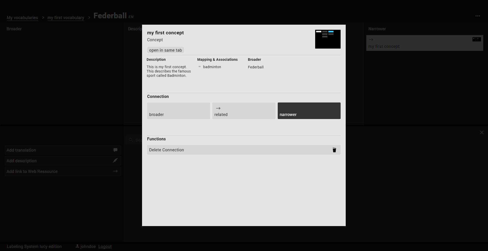](_images/ug_e_concept_eb_search12.PNG)

#### Suche in Referenzvokabular

Die Suche in Referenzvokabularen wird durch Klick des rechten Tab im Such-Modul aktiviert.

Durch Klick auf den `Config`-Button können die Referenzthesauri, die durchsucht werden sollen ausgewählt werden.  Ein Klick auf das Vokabular aktiviert / deaktiviert das Vokabular. Ein Klick auf das X oder neben den Dialog speichert die Angaben.

Durch Klick auf das Suchergebnis kann wie zuvor beschrieben dieses Konzept semantisch verknüpft werden.
